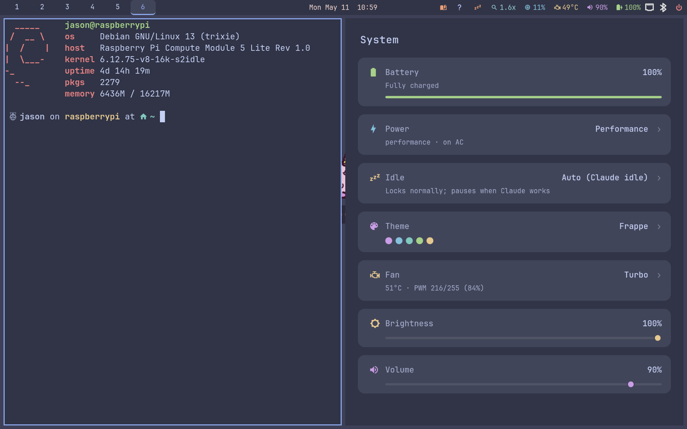

# system-dashboard



A small, slick Tauri-based dashboard that surfaces seven live system metrics on the [Argon ONE UP](https://argon40.com/products/argon-one-up-cm5-laptop-core-system) (and any Linux machine with the matching hardware paths). Replaces the stock Argon dashboard that the hardware battery key used to open.

| Tile | Source | Click action |
|---|---|---|
| Battery | CW2217 fuel gauge over I2C (percent + current draw → time-remaining estimate). Level-appropriate glyph; turns green and reads "Fully charged" at 100%. | — |
| Power | `/sys/devices/system/cpu/cpu0/cpufreq/scaling_governor` + AC inferred from CW2217. Icon flips between bolt / gauge / leaf per governor. | `power-mode toggle` (cycles ondemand → powersave → performance) |
| Idle | `/tmp/.idle-toggle-mode` (written by `bin/idle-toggle`) | `idle-toggle cycle` (on → off → claude) |
| Theme | `~/.config/sway-themes/current`; palette swatches parsed directly from the rendered stylesheet so they always match the active theme. | `switch-theme --picker` |
| Fan | `/dev/shm/argon-fan.json` (written by the [argon-fan](../argon-fan/) daemon) | `argon-fan picker` |
| Brightness | `/tmp/.brightness_level` cache file written by `bin/brightness`. | slider — drag to `brightness set <N>` |
| Volume | `wpctl get-volume @DEFAULT_AUDIO_SINK@`; icon adapts to level / muted state. | slider — drag to `wpctl set-volume @DEFAULT_AUDIO_SINK@ <N>` |

## Why this exists

The Argon ONE UP keyboard has a hardware battery key (it emits `Pause`, not `XF86Battery` as you might expect) that used to launch Argon's own dashboard. Since we replaced their battery polling with [argon-battery-rs](../argon-battery-rs/), the stock dashboard no longer has live data and the key effectively did nothing.

This app fills the same role, but with the data we actually have plus a little more (fan mode, idle/lock state, current theme, brightness and volume sliders), and is theme-aware so it follows the rest of the desktop palette.

## Architecture

Built with **Tauri 2** (Rust backend + a WebView frontend). The frontend is vanilla HTML/CSS/JS — no Node toolchain.

```
src/
├── main.rs        # Tauri builder + IPC commands + WM detection
├── battery.rs     # I2C reads from CW2217
├── power.rs       # governor + AC presence
├── idle.rs        # idle-toggle state file reader
├── theme.rs       # current theme name + rendered CSS path
├── fan.rs         # argon-fan state file reader
├── brightness.rs  # cache-file reader + shells to `brightness set`
└── volume.rs      # wpctl get-volume / set-volume
```

Frontend (`dist/`) calls a single `snapshot` IPC command every 2 seconds while focused, 10 seconds while blurred (easier on battery). Click handlers and slider input events invoke separate IPC commands that shell out to existing user scripts (`power-mode`, `idle-toggle`, `switch-theme`, `argon-fan`, `brightness`) or `wpctl`. Slider drags are debounced and the poll loop doesn't fight an active drag.

### Window decorations

On startup the app detects the window manager via signature env vars (`SWAYSOCK`, `HYPRLAND_INSTANCE_SIGNATURE`, `NIRI_SOCKET`, `I3SOCK`, with `XDG_CURRENT_DESKTOP` as fallback). On tiling WMs it calls `set_decorations(false)` so the CSD titlebar with min/max/close buttons doesn't fight the WM's own window management. On stacking environments (GNOME, KDE, Cinnamon) the decorations stay so users have the familiar affordances — Mutter forces SSD when the client declines CSD, so GNOME draws its own titlebar automatically.

## Theming

`sway-themes/templates/dashboard.css` defines CSS custom properties (`--bg`, `--text`, `--accent`, per-tile accents, slider thumb colors, etc.) using Catppuccin palette tokens (`@@BASE@@`, `@@MAUVE@@`, …). When you switch theme with `Mod+T`, `bin/switch-theme` renders the template to `~/.config/system-dashboard/dashboard.css`. The backend file-watches that file and emits an event to the webview, which reloads the stylesheet → the dashboard recolors live without restarting.

## Build

This crate **does not build during `install.sh`**. The installer downloads a prebuilt `aarch64` binary from the latest `system-dashboard-v*` GitHub release. For local dev:

```bash
sudo apt install -y \
    libwebkit2gtk-4.1-dev \
    libgtk-3-dev \
    libayatana-appindicator3-dev \
    libssl-dev librsvg2-dev libsoup-3.0-dev patchelf

cd system-dashboard
cargo build --release
./target/release/system-dashboard
```

First Tauri build on a Pi 5 takes 5–15 minutes (`tauri` pulls a large transitive dep tree). Incremental builds are fast.

## Release flow

A push of a `system-dashboard-v*` tag triggers `.github/workflows/release-system-dashboard.yml`. The workflow runs on `ubuntu-24.04-arm`, builds the release binary, and uploads `system-dashboard-aarch64` to the GitHub Release for that tag. The installer queries the GitHub API for the latest such tag and downloads the asset.

To cut a release:

```bash
git tag system-dashboard-v0.1.0
git push origin system-dashboard-v0.1.0
```

You can also run the workflow manually via `workflow_dispatch` — that path uploads to workflow artifacts only (no release).

## Sway keybindings

Bound in `sway/config`:

```
bindsym $mod+Shift+d exec system-dashboard
bindsym Pause exec system-dashboard         # Argon ONE UP hardware battery key
bindsym XF86Battery exec system-dashboard   # generic battery key on other keyboards
```

`Mod+D` is taken by the wofi app launcher (`$menu`), hence `Mod+Shift+d` for the dashboard.

## Use on other window managers / desktops

The `.desktop` file shipped at `/usr/local/share/applications/system-dashboard.desktop` exposes the app to any launcher (wofi-drun, gnome-shell activities, KDE krunner, etc.).

To bind a key on a different WM, run the binary directly:

- **i3**: `bindsym $mod+Shift+d exec system-dashboard`
- **Hyprland**: `bind = SUPER SHIFT, D, exec, system-dashboard`
- **GNOME**: Settings → Keyboard Shortcuts → custom shortcut

The interactive bits — `power-mode`, `idle-toggle`, `switch-theme`, `argon-fan`, `brightness` — are sway-help-specific scripts. Volume goes through `wpctl` and works anywhere PipeWire is running. If you're using this app outside the sway-help desktop, the read-side will still surface battery/fan/theme/etc., and volume + audio mute work; the other click handlers will no-op unless their backing scripts are on `$PATH`.

## License

Apache-2.0
